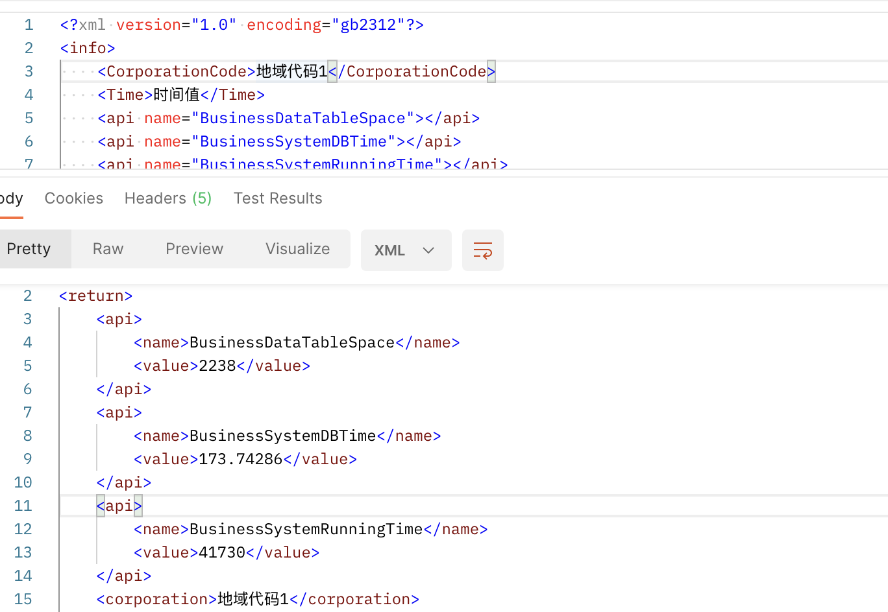

# sgcc

## 国家电网所有指标聚合标准输入输出项目

### 输入xml格式

```
<?xml version="1.0" encoding="gb2312"?>
<info>
    <!--传入的地域代码可以为一个或多个-->
	<CorporationCode>地域代码1,地域代码2,地域代码3….</CorporationCode>
    <!--传入的指标名称可以为一个或多个--> 
    <Time>时间值</Time>
    <api name="指标名称1"></api>
    <api name="指标名称2"></api>	
    <api name="指标名称n"></api>
</info>
```

### 输出
1. 多数据单独输出xml
```
<?xml version="1.0" encoding="gb2312"?>
<LOGINUSER>
<USERINFO>
    <LDAPID></LDAPID>--填写统一目录用户名，若此用户没有目录用户名则暂填写自己系统中的登录名
    <CORPORATION>江苏省电力公司</CORPORATION>--省公司名称或国家电网公司总部，若人员为省公司本部人员，则下面的SUBCOMPANY填写XXX省电力公司本部，省公司人员的情况下，BUREAU可不填，但标签必需保留。若为国家电网公司总部人员，则此处填写“国家电网公司总部”，下面的SUBCOMPANY和BUREAU均可不填，但这2个标签必需保留。
    <SUBCOMPANY>南通市供电公司</SUBCOMPANY>--地市公司名称，若人员为地市公司本部人员，则下面的BUREAU填写XXX供电公司本部。
    <BUREAU>海门市供电局</BUREAU>--县级单位名称
    <DEPARTMENT>XX部</DEPARTMENT>--部门名称
    <NAME>张三</NAME>--用户名，不是账号，而是用户姓名
    <ISLDAPID>1</ISLDAPID>--上述LDAPID是否为目录用户名，是填1，否填0
</USERINFO>
<USERINFO>
    <LDAPID></LDAPID>
    <CORPORATION>国家电网公司总部</CORPORATION>
    <SUBCOMPANY></SUBCOMPANY>
    <BUREAU></BUREAU>
    <DEPARTMENT>XX部</DEPARTMENT>
    <ISLDAPID>1</ISLDAPID>
    <NAME>李四</NAME>
</USERINFO>
<USERINFO>
    <LDAPID></LDAPID>
    <CORPORATION>江苏省电力公司</CORPORATION>
    <SUBCOMPANY>江苏省电力公司本部</SUBCOMPANY>
    <BUREAU></BUREAU>
    <DEPARTMENT>XX部</DEPARTMENT>
    <NAME>王五</NAME>
    <ISLDAPID>0</ISLDAPID>
</USERINFO>
<USERINFO>
    <LDAPID></LDAPID>
    <CORPORATION>江苏省电力公司</CORPORATION>
    <SUBCOMPANY>南通市供电公司</SUBCOMPANY>
    <BUREAU>南通市供电公司本部</BUREAU>
    <DEPARTMENT>XX部</DEPARTMENT>
    <NAME>王五</NAME>
    <ISLDAPID>1</ISLDAPID>
</USERINFO>
</LOGINUSER>

没有人员的情况送空XML格式字符串：
<?xml version="1.0" encoding="gb2312"?>
<LOGINUSER>
</LOGINUSER>
```

2. 其他xml输出
```
<?xml version="1.0" encoding="gb2312"?>
<return>
	<status>success/failure</status>
	<message>执行的结果提示</message>
	<!-- 若status的值为failure，reason节点才存在 -->
	<reason>出错的原因</reason>
	
    <Corporation id=”地域代码1”>
        <api name="指标名称1">
            <value>xx</value>
        </api>
        <api name="指标名称2">
            <value>xx</value>
        </api>	
        <api name="指标名称n">
            <value>xx</value>
        </api>
    </Corporation>
    <Corporation id=”地域代码2”>
        <api name="指标名称1">
            <value>xx</value>
        </api>
        <api name="指标名称2">
            <value>xx</value>
        </api>	
        <api name="指标名称n">
            <value>xx</value>
        </api>
    </Corporation>...
    <Corporation id=”地域代码N”>
        <api name="指标名称1">
            <value>xx</value>
        </api>
        <api name="指标名称2">
            <value>xx</value>
        </api>	
        <api name="指标名称n">
            <value>xx</value>
        </api>
    </Corporation>
</return>
```
3. 展示事例输入输出


## getStatus 调用
```
当调用getStatus方法获取确定日登录人员名单和在线人员名单数据是否准备好，返回值为0或1;
返回0表示日登录人员名单和在线人员名单数据未准备完成；返回1表示日登录人员名单和在线人员名单数据已经准备好，可供I6000获取。
```